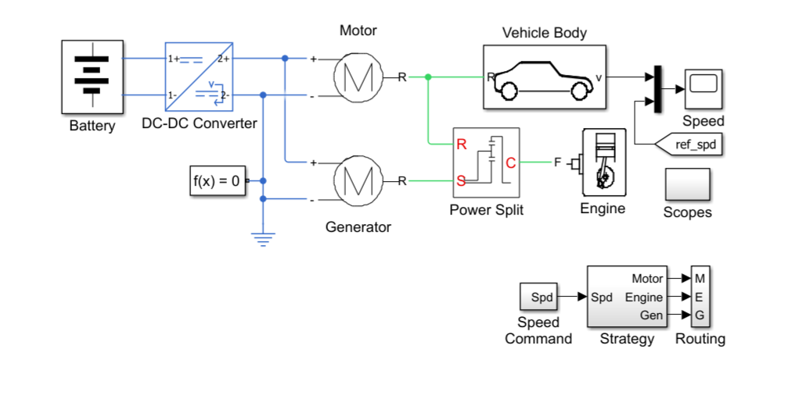
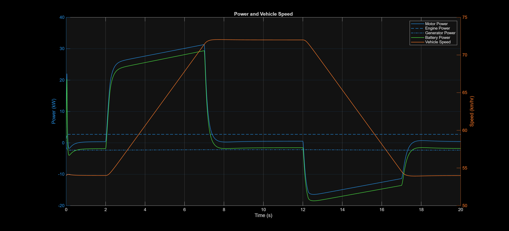
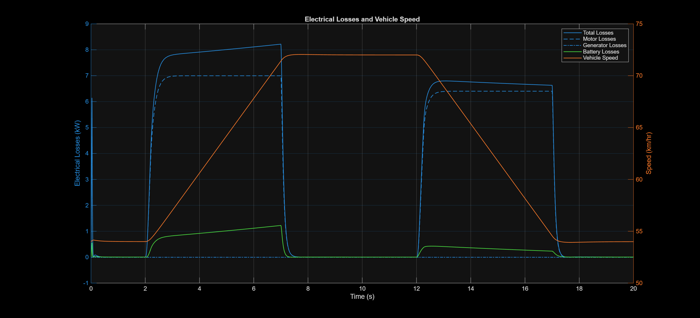

# Power Split Hybrid Electric Vehicle (HEV)

## About This Project

I developed this project to understand the working of Power Split Hybrid Electric Vehicles using MATLAB/Simulink. The model helped me study power flow, regenerative braking and electrical losses in hybrid vehicle powertrains.

## Skills Demonstrated

- MATLAB Programming
- Simulink Modeling
- Power Electronics
- Hybrid Electric Vehicles
- Electrical Loss Analysis
- Regenerative Braking
- Energy Management
The model demonstrates the interaction between:

- Internal Combustion Engine (ICE)
- Electric Motor
- Generator
- Battery System
- Power Electronics
- Planetary Gear Set

The simulation evaluates power flow, regenerative braking performance, electrical losses, and vehicle speed characteristics.

---

## Objectives

- Model a Power Split HEV architecture.
- Analyze power flow between engine, motor, generator, and battery.
- Evaluate regenerative braking operation.
- Calculate electrical losses.
- Study vehicle performance under varying operating conditions.

---

## Software Used

- MATLAB
- Simulink
- Simscape Electrical

---

## Project Files

| File Name | Description |
|------------|------------|
| PowerSplitHEV.slx | Main Simulink model |
| PowerSplitHEVE.m | Main simulation script |
| PowerSplitHEVPlotPower.m | Power flow analysis |
| PowerSplitHEVPlotLosses.m | Electrical loss analysis |
| simlogNeedsUpdate.m | Logging utility |

---

## Features

- Hybrid powertrain simulation
- Power distribution analysis
- Motor-generator modeling
- Battery power monitoring
- Electrical loss calculation
- Regenerative braking analysis
- Vehicle speed tracking

---

## Results

The simulation provides:

- Engine power output
- Motor power consumption
- Generator power generation
- Battery charging/discharging behavior
- Electrical losses
- Vehicle speed response

---

## Future Improvements

In the future, I plan to add:

- State of Charge (SOC) estimation
- Drive cycle implementation
- Fuel economy analysis
- Advanced energy management strategies
- AI-based power management

---
## Simulation Results

### Simulink Model

### Power Flow Analysis

### Electrical Loss Analysis

## Author

Hameed

Electrical Engineering Student
